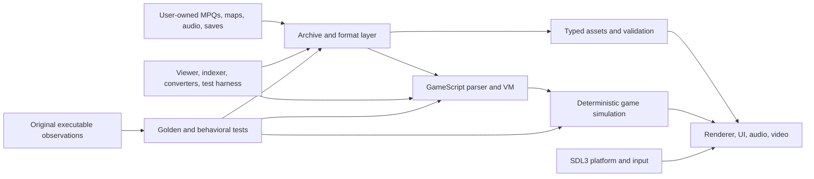

# Native Preservation Engine Candidate Plan

## Decision status

> ### Reassessed 2026-09-21
>
> **Still a candidate, but the estimates below are measurably wrong and should not be quoted as
> they stand.** The table further down says Stage 1 is 2-6 weeks and assumes *one experienced
> developer working full-time*. Stage 0 and Stage 1 both closed in **9 days** (first commit
> 2026-09-11), not full-time, and in the same window the project also shipped the entire modding
> toolkit, decoded the savegame container, walked 1,905 operator bodies, recovered 23,005 MPQ
> names and ran ten engine-acceptance rungs — none of which was in Stage 1's scope.
>
> **The only two stages with data came in roughly 4-8x faster than this document predicted.** Its
> later figures inherit that error and are quoted at your own risk.
>
> **Why it does not extrapolate cleanly.** Stages 0-1 are discovery against a *perfect oracle*:
> byte-identity. That runs thousands of times a day, needs no human, and reports failure
> instantly. Stages 3-5 contain a category that behaves nothing like it — **fidelity against a
> human-gated oracle.** The evidence class "Observed in gameplay" exists precisely because macOS
> will not let this project drive the Wine window, so every such measurement costs an attended
> sitting. Nine days produced about six. That number does not improve with more compute, and it is
> the only clock that matters for a fidelity claim.
>
> **Revised, by work type rather than one multiplier:**
>
> | Term | Character | Revision |
> | --- | --- | --- |
> | Operator implementation (~1,450 built-ins; bodies already walked, 1,198 fields across 100 structures recovered) | discovery-like, testable offline | apply the observed speedup — **months, not years** |
> | Simulation fidelity (combat, pathfinding, AI, diplomacy) | no cheap oracle; the expensive one is human-gated | **stays large**; most of the residual risk |
> | Integration, UI, packaging, compatibility | ordinary engineering | modest speedup |
>
> Honest revised figure for Stage 5: **8-18 months at the observed cadence**, with the spread
> dominated by the fidelity term rather than the coding term, and that term bounded by operator
> availability rather than throughput.
>
> **The decision this should turn on has not changed, and it is cheap to buy.** The gap between
> "operators named by some script" (1,445-1,480) and "operators execution actually stands on"
> (33-43) is **25x wide**, and it is the single input that decides whether the operator term is
> months or years. Nine of the top twelve VM blockers are *script-defined names*, not engine
> operators — module-loading and dependency-ordering work, no simulation. Closing those and
> re-running the execution census would converge that range hard, is useful to the modding toolkit
> regardless, and at the observed rate is days of work.
>
> **Recommendation: do not commit to or abandon the rewrite yet. Finish the Stage 2 module loader,
> re-run the census, and decide on a measured number instead of a discredited estimate.**
>
> One thing has changed on the *demand* side, and it is recorded in
> [resolution and upscaling](resolution-and-upscaling.md): the original engine is architecturally
> incapable of rendering above 640x480, because the mode is two `push` immediates with no
> configuration path. Any ambition that needs a higher resolution has no path through the original
> binary. That is a much firmer basis for the decision than a scope estimate.

**Candidate, not a commitment.** The goal would be a clean-room, 64-bit native engine that loads a user's legally obtained Lords of Magic: Special Edition data. The existing Windows executable remains the behavioral reference while we replace bounded capabilities behind testable interfaces.

The evolving asset tool removes one early uncertainty: native Rust code can open all five core MPQ archives, classify their contents, decode the primary picture and sprite formats, render PBM images and IMP animations, and resolve map cells through original terrain art. It does not yet establish that the simulation or GameScript runtime can be reproduced economically. Current Stage 1 evidence and gaps are tracked in the [native asset layer record](native-asset-stage.md).

## Goals

- Preserve the game on current macOS, Windows, and Linux without a 32-bit Windows compatibility layer.
- Load original MPQ data rather than redistribute copyrighted game assets.
- Favor behavioral fidelity and deterministic tests before enhancements.
- Keep original data, community patches, and future mods usable where their assumptions are understood.
- Make formats, scripts, and engine behavior inspectable enough that future contributors can continue the work.
- Use AI as a development and research assistant; do not put generative AI into the runtime.

## Non-goals

- A source-level port of `lomse.exe`; its source is not available to us.
- A big-bang rewrite that must reach feature parity before producing value.
- Automatic compatibility with every undocumented mod or save file.
- Distribution of Sierra/Rebellion assets, binaries, or complete modified archives.
- New graphics or gameplay mechanics during the fidelity phase.

## Proposed architecture

### Initial technology choices

| Area | Candidate | Reason | Revisit when |
| --- | --- | --- | --- |
| Core implementation | Rust | Memory safety, good binary tooling, portable 64-bit builds, and explicit unsafe boundaries | FFI or VM work becomes materially harder than an equivalent C++ prototype |
| Window/input/render/audio | SDL3 | Cross-platform and sufficient for a 2D preservation engine | Original rendering semantics require GPU behavior SDL cannot express cleanly |
| MPQ access | StormLib behind a small Rust wrapper | Mature behavior and already validated against all installed archives | Packaging the native library becomes harder than implementing the required read-only MPQ subset |
| GameScript | Purpose-built parser and VM | The scripts are central, data-driven, and unlike a current off-the-shelf language | Evidence shows the executable depends on unreasonably large or inseparable native built-in behavior |
| Reference testing | Original game in preserved Wine profiles | It is the only available behavioral oracle | A behavior has a stronger primary specification or reproducible test fixture |

StormLib is a bridge, not a permanent architectural dependency. Its calls are isolated so a future safe MPQ implementation can replace it without changing asset or simulation code.

## Staged path and stop/go gates

Estimates assume one experienced developer working full-time with AI assistance. Part-time work will usually take two to three times the calendar duration. They are discovery ranges, not delivery promises.

| Stage | Deliverable | Indicative effort | Continue only if |
| --- | --- | ---: | --- |
| 0. Evidence baseline | Reproducible archive inventory, binary imports, patch/mod comparisons, preserved runnable profiles | Complete for the initial pass | Reference profiles remain reproducible and untouched |
| 1. Native asset layer | MPQ browser; lossless image, palette, transparency, map, and audio probes; golden fixtures | 2–6 weeks | Common assets decode consistently and unknown formats are bounded |
| 2. GameScript VM probe | Lexer/parser, stack/value model, module loading, traces, and a representative script subset | 1–3 months | **Started:** lexical/vocabulary milestone passes; continue only if built-ins can be classified and the VM reproduces useful original script traces |
| 3. Exploration shell | Native menus, map display, camera/input, object placement, and save-state prototype | 3–6 months cumulative | Core world data and UI semantics are understandable without executable patching |
| 4. Playable vertical slice | One faction, economy, movement, a battle, basic AI, and save/load | 6–18 months cumulative | Deterministic end-to-end play is fun enough and accurate enough to justify expansion |
| 5. Faithful preservation engine | Campaigns, all faiths, AI/diplomacy, combat, editors, compatibility work, packaging | Roughly 2–5 person-years | Incremental releases retain users/contributors and legal distribution boundaries remain workable |

The first checkpoint is intentionally useful even if the full rewrite stops: asset and script tools directly improve conventional modding.

## Evidence from the first asset spike

On 2026-09-11 the Rust spike opened the installed GS5R3 `pic.mpq` read-only and measured:

- 1,406 archive entries enumerated in about 0.20 seconds.
- 1,406 entries readable.
- 1,377 files detected as IFF `FORM PBM` images.
- 1,377 of 1,377 PBM images decoded successfully in about 1.0 second total.
- A 612×120, 256-color, ByteRun1-compressed UI atlas displayed in a resizable native SDL3 window.

One portrait exposed a valid scanline-boundary edge case in ByteRun1 compression. The decoder was corrected and a regression test added. The displayed atlas also exposed a likely game-specific bright-green chroma-key convention even though its PBM header declares no standard mask. That compositing rule remains an explicit renderer investigation.

This is a **go** result for continued archive and image tooling. It says little about the hardest risk: reimplementing the script host and simulation built-ins.

The first Stage 2 experiment now tokenizes all 4,692 `.gs` members across the baseline, 3.02, and GS5R3 profiles with zero fatal failures. It inventories static `run` references and finds roughly 2,100 executable names per profile that also appear as strings in `lomse.exe` after excluding script-defined literal names. A small stack/dictionary interpreter then loads the shipped 3.02 `standard.gs` module with an empty resulting operand stack and correctly executes its `min` and `max` procedures. This is a **go** result for continued bounded VM work, but the binary correlation is deliberately a candidate set rather than a count of native built-ins. See the [GameScript probe record](gamescript-format.md).

The next Stage 1 milestones expanded the scan to all five GS5R3 core archives: 9,804 of 9,804 members are readable and classified with no probe failures. They identified 3,098 WAVE files and paired 1,800 IMP sprite binaries with 1,800 generated headers. All 1,800 IMP binaries now pixel-decode, including both observed record variants and 8/4/2/1-bit indexed storage; representative unit frames render recognizably in an SDL viewer. The model exactly matches 1,795 of 1,800 pairs (corrected 2026-09-17; it read 1,788 of 1,798 before a frame-table decoder fix), while five value-pinned metadata mismatches and two value-pinned orphan catalog notes account for the rest and anything else still fails. A separate bounded parser reads all 365 installed map/scenario/component files, parses all 26 tile-set definitions, renders the standard world through original terrain art, and structurally decodes 21,117 placed-object records across the six record layouts the 365 maps use. This strengthens the **go** decision for asset tooling but does not justify shortening later simulation estimates.

## Verification strategy

- Store no original assets in Git. Tests should use tiny synthetic fixtures or hashes/metadata produced from a local legal installation.
- Compare native decoder output with an independent implementation and record pixel hashes for user-local fixtures.
- Record deterministic script traces from the original engine where observability permits, then replay the same inputs in the VM.
- Snapshot simulation state at turn boundaries and require identical results for fixed seeds.
- Use side-by-side screenshots for palette, transparency, coordinate, and scaling behavior.
- Keep vanilla, 3.02, GS5R3, and development data lineages separate in compatibility tests.

## Principal risks

| Risk | Why it matters | Early experiment |
| --- | --- | --- |
| Native GameScript built-ins | Scripts may delegate much of the game to opaque C/C++ routines | Catalogue names/call shapes and execute three representative subsystems in a traced VM |
| Simulation fidelity | Pathfinding, AI, diplomacy, and combat may be hard-coded and timing-sensitive | Reproduce a small deterministic scenario from captured inputs and outcomes |
| Save compatibility | Binary layout and engine object identity are unknown | Inventory headers and diff controlled saves before promising compatibility |
| Rendering conventions | Palettes, chroma keys, sprites, and coordinate assumptions are only partly known | Compare native renders of representative UI, portrait, map, and animated assets |
| Multiplayer | DirectPlay is obsolete and lockstep assumptions are unknown | Defer networking until single-player determinism is demonstrated |
| Scope | A faithful engine is far larger than a mod toolkit | Enforce stage gates and ship reusable tools at each stage |
| Legal/distribution | Compatibility work must not become asset redistribution | Keep repository code-only and require user-supplied game data |

## Recommended next decision

Finish Stage 1 far enough to inventory all archive types and render representative UI, portrait, map, and sprite resources. In parallel with ordinary mod-tool work, perform a narrowly scoped GameScript VM spike. That second result—not the successful picture decoder—should decide whether a complete native engine is a responsible long-term commitment.
